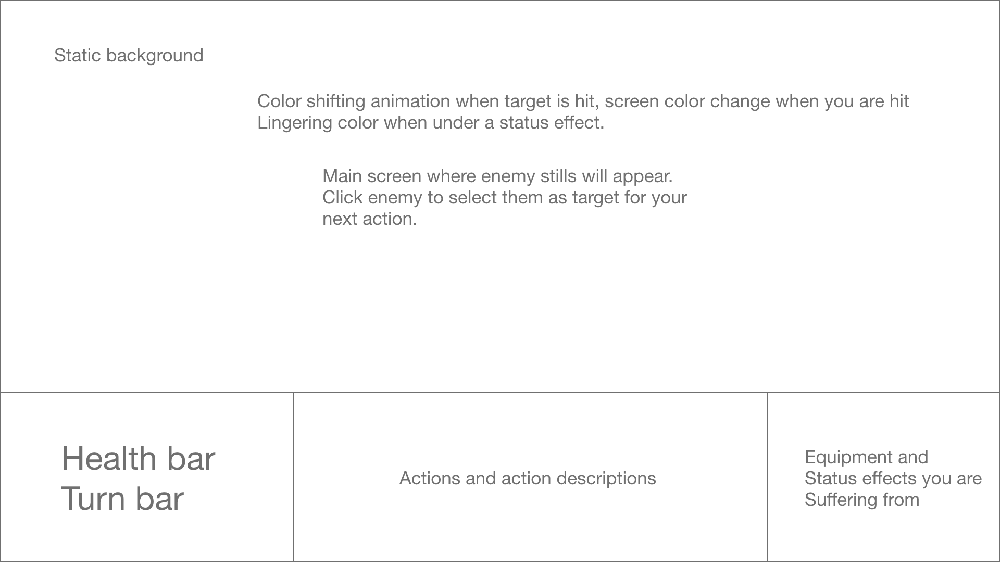
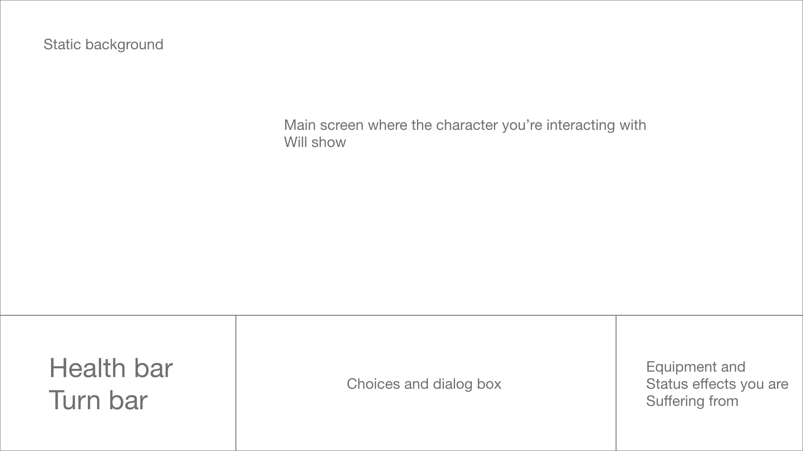

# Ramesses 
You play Ramesses; it's the 70s  and Ramesses is a Bronx street punk raised in a orphanage run by a mad one armed ex-triad. Ramesses' life long friend and blood brother Atlas has been kidnapped by **The Raptures Wronged**. A street gang from upstate New York. The Bronx mob family gave permission to the wronged to set up shop in one ofthe several story apartment buiildings. Your Shifu says it was Atlas' fault for getting cought but that doesn't matter to Ramesses. Armed with you caution tape wrapped bat you will Raid that building, save the only family you have in this burning Burough and brake any Jive fool dumb enough to get in your way! 

### Rules of the game 
A **_first person Turn based RPG_**; _in combat_ you'll have a set of actions you can perform to defeat the enemies before you. _Out of combat_ you'll choose directions to go, rooms to search and characters to interact with.

### Techincal Challenges
CSS - Setting up enemy positions, clicking to select them for the proceeding actions to take effect to their particular stats.

JS - Adding and removing status effects in a [simple and clean](https://www.youtube.com/watch?v=UigzN-4JR14) way.

### Wireframe
When in **_Combat_** the screen should look something like: 
 

When the player is out of  Combat or _OOC_, the screen should look something like this: 

All in all is a a dumbed down version of [THIS](https://www.pocketgamer.com/articles/057732/demon-gaze-is-ready-to-bring-first-person-dungeon-crawling-to-the-vita/)
### Timeline

#####Tuesday -
*Get proposal and wireframe done.
*Figure out the number of backgrounds you'll need to finish. 
*Build basic character stats.
*Build Combat for multiple enemies and multiple actions (adding and removing status effects)

#####Wednesday -

*Set up UI: NPCs placement, stat placement, health bar, damage animation, status animation, choices and selection functios and animations (ALL DAY!)

#####Thursday - 
*Construct enemies and other NPCs (stats, images, onscreen pop-ups and interactions)

######Friday -
*_DIALOG, DIALOG, DIALOG, DIALOG, and DIALOG,_ : Cause they have to spit hot fire!

######Saturday -
*Run through the game and fix EVERYTHING!

#####Sunday -
Give it to someone else to play, then fix **EVERYTHING** _again_.